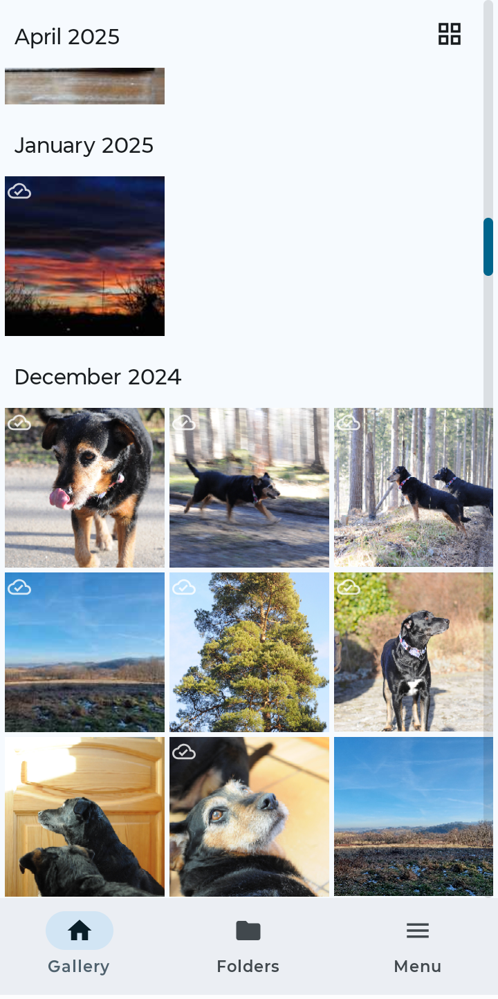
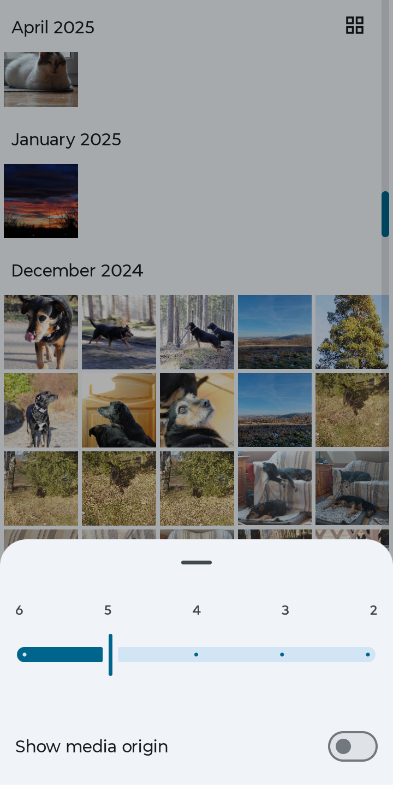
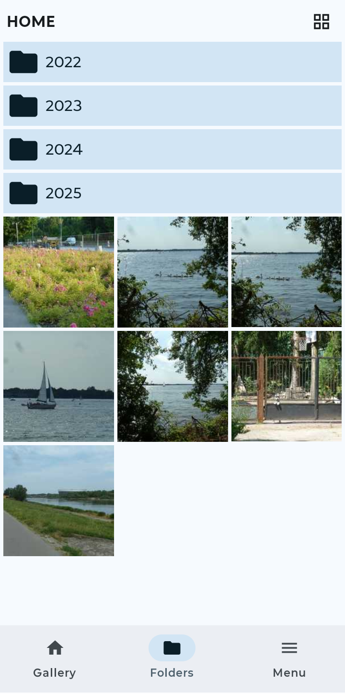
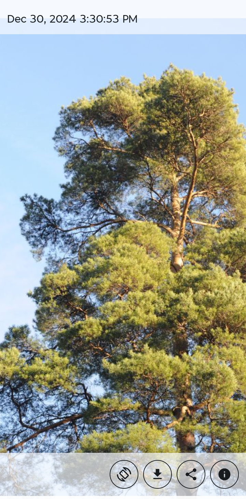

# Migawka

An application for photo browsing and synchronization.

    
    
    
    

## Client

See [client2/README.md](client2/README.md).

## Server

See [server/README.md](server/README.md).

### Dev installation

* [Golang v1.25.3](https://go.dev/doc/install)
* [protoc v32.1](https://protobuf.dev/installation/)
* [protoc go plugin (v1.36.10)](https://grpc.io/docs/languages/go/quickstart/)

